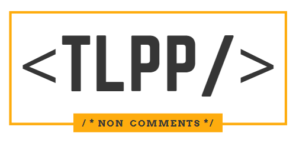

<p align="center">
  
  <h1 align="center">EXEMPLOS: Documentação de APIs REST em TLPP</h1>
</p>

> [](https://opensource.org/licenses/MIT)<br>Esta é uma iniciativa open source, sob **Licença MIT**, e como tal, é disponibilizada **sem qualquer garantia, expressa ou implícita**, não havendo restrições sobre usar, copiar, modificar, fundir, publicar, distribuir, sublicenciar e/ou vender cópias de seu conteúdo.

## Informações importantes

O **tlppCore** contém uma ferramenta nativa para a geração de documentação das APIs presentes no ambiente. Esse motor será distribuído através do tlpp.rpo juntamente com o appserver e esta ferramenta não estará sob a licença MIT. O motor é de *propriedade* da **TOTVS S/A**.

**Versão disponível:** O motor estará disponível a partir do tlppCore 01.04.02 + AppServer 20.3.1.10.

O projeto contindo nesse repositório não é a implementação do motor de geração da documentação do tlppCore mencionada acima, portanto os fontes aqui presentes são apenas exemplos de como utilizar os recursos disponíveis para a geração dos documentos.

> <hr>
> <div style="align-items: center; display: flex;">&nbsp;&nbsp;&nbsp;&nbsp;<b>DISCLAIMER</b></div>
> <br>
> O módulo REST-DOC é um recurso extremamente novo no tlppCore e ainda está em fase de implementação. O produto está recebendo contantes ajustes, melhorias e, portanto, sua documentação ainda está em fase de construção.
> <br><br>
> Agradecemos o interesse em avaliar o produto, e nos colocamos à inteira disposição para eventuais dúvidas.<br>Por favor, usufruam do recurso de abertura de Issues para esse projeto!
> <hr>

## Exemplos

Os exemplos implementados nesse projeto traz luz ao aprendizado sobre a ferramenta, porém é imprescendível que a documentação oficial do motor seja lida através da [Wiki](https://github.com/totvs/tlpp-sample-rest-documentation/wiki) para obter detalhes de uso dos recursos disponibilizados.

### Exemplos Básicos

- ***Somente descrição:*** \src\rest\basic\sample_01_basic.tlpp
- ***Documentando utilizando annotation:*** \src\rest\basic\sample_02_basic.tlpp
- ***Documentando diretamente no i18n:*** \src\rest\basic\sample_03_basic_by_id.tlpp
- ***Documentando através de função:*** \src\rest\basic\sample_04_basic_by_function.tlpp
- ***Descrição multi-linha:*** \src\rest\basic\sample_05_basic_multiline.tlpp

### Exemplo Completo (Documentação + Componente + i18n)

Resumo do exemplo completo -> [complete.md](https://github.com/totvs/tlpp-sample-rest-documentation/blob/main/src/rest/complete/complete.md)

- ***REST:*** \src\rest\complete\sample_complete.tlpp
- ***REST (localização):*** \src\rest\complete\sample_complete-i18n.tlpp
- ***DOC:*** \src\rest\complete\sample_complete_DOC.tlpp
- ***DOC (localização):*** \src\rest\complete\sample_complete_DOC-i18n.tlpp
- ***Componente:*** \src\components\sample_components.tlpp

### Endpoints dinâmicos criados por JSON

O REST tlppCore possibilita a subida e criação de serviços REST através de JSON de forma dinâmica, e portanto esses serviços não utilizam Annotation.

Os exemplos abaixo criam DOC para esses casos.

- ***Infraestrutura + EndPoints:*** src\rest\dynamic endpoints\dynamic_rest_start.tlpp
- ***REST:*** src\rest\dynamic endpoints\dynamic_rest_services.tlpp
- ***DOC List:*** src\rest\dynamic endpoints\dynamic_list_functions.tlpp
- ***DOC REST:*** src\rest\dynamic endpoints\dynamic_rest_services_DOC.tlpp

## Gerando a documentação

Para gerar a documentação dos exemplos desse projeto, como também dos documentos criados por você, será necessário executar a função do tlppCore capaz de gerar o documento final.

> **Atenção:** Antes de executar a função, é imprescendível que o serviço REST esteja funcionando e acessível.

Após o ambiente estiver disponível, a execução será através da seguinte função:
```
tlpp.doc.generate( 'swagger', 'api_doc', {8080} )
```
Para mais detalhes sobre a sintaxe, veja em: *\src\main.tlpp*

Nesse projeto, há uma cópia do arquivo gerado com o resultado desses exemplos.
Esse arquivo você pode acessar em: *\output\api_doc_8080.yaml*

> Pode-se validar o arquivo gerado através de uma ferramenta disponibilizada pela SmartBear Software, basta acessar a seguinte URL: [editor.swagger.io](https://editor.swagger.io/)
